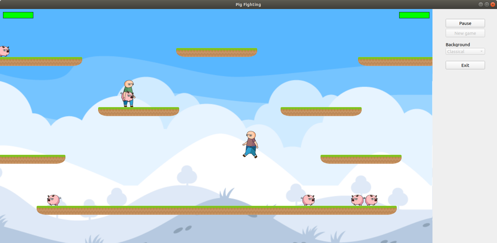
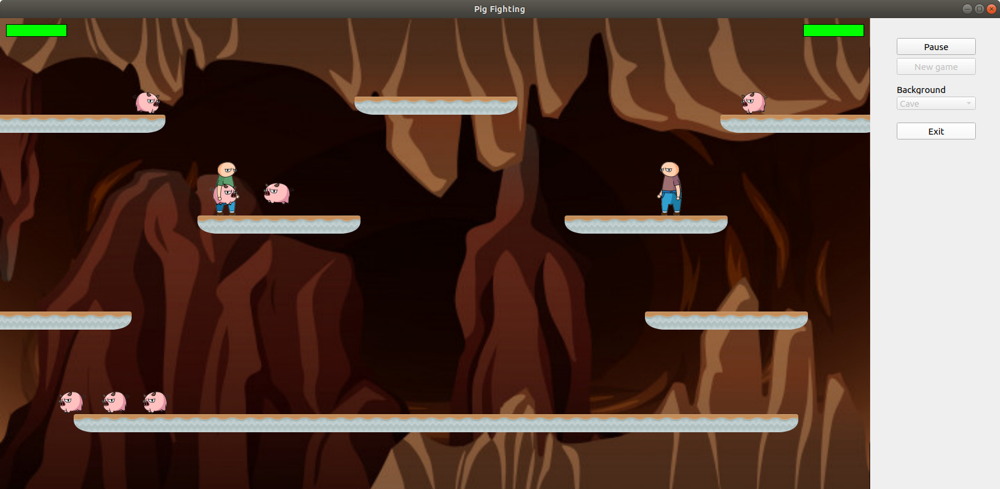

# Pig Fighting

In this repository you will find my fork from our university team project, where I periodically make changes and train in writing and refactoring code and implementing design patterns. 

The original version of our project can be found [here](https://github.com/KatsiarynaDzibrova/pig_fighting).

## The original version was developed by
* [@KatsiarynaDzibrova](https://github.com/KatsiarynaDzibrova)
* [@RainMustFall](https://github.com/RainMustFall)
* [@katyamoroz1](https://github.com/katyamoroz1)
* [@Zipp1e](https://github.com/Zipp1e)

## About
Pig Fighting is a project written in C++ & Qt, which is a game where two players fight each other using pigs running around the field as shells. 

### Control of the first player
<kbd>W</kbd>, <kbd>A</kbd>, <kbd>S</kbd>, <kbd>D</kbd> — move. 

<kbd>Space</kbd> — catch or throw pig. 

### Control of the second player
<kbd>&#8592;</kbd>, <kbd>&#8593;</kbd>, <kbd>&#8594;</kbd>, <kbd>&#8595;</kbd> — move. 

<kbd>Shift</kbd> — catch or throw pig. 
